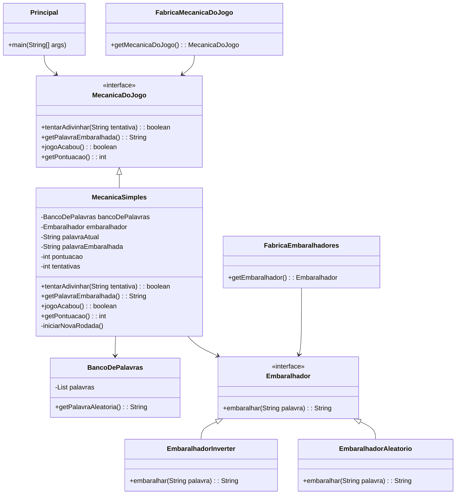

 <h1 align="center">Jogo das Palavras Embaralhadas</h1>

O objetivo desse exercício é criar um jogo onde partes de sua execução possam ser trocadas.

O jogo é simples: é apresentado ao jogador uma palavra com as letras embaralhadas e o jogador deve
tentar adivinhar a palavra correta. O jogo será jogado no próprio console e a lista de palavras utilizadas
pode ser fixa (pelo menos 20).

> [!IMPORTANT]
>
> A classe Scanner pode ser utilizada para ler a entrada do usuário no console.
> Ela deve ser criada da seguinte forma: Scanner in = new Scanner(System.in); e
> em seguida métodos como nextLine() ou nextInt() podem ser utilizados para
> recuperar o que foi digitado pelo usuário.

> [!WARNING]
>
> ### O jogo deve possuir os seguintes componentes com as seguintes responsabilidades:
>
> - Principal: representa a classe com o método main(). É essa classe que é responsável por ler a entrada do usuário e por imprimir as informações no console. Nenhuma outra classe pode imprimir ou ler do console.
> - <strong> BancoDePalavras</strong> : classe que possui um método que retorna uma palavra retirada aleatóriamente de uma lista de palavras lida a partir de um arquivo.
> - <strong>Embaralhador</strong>: interface que representa classes responsáveis por receber uma palavra e retornar ela embaralhada. Pelo menos duas implementações deverão ser feitas.
> - <strong>FabricaEmbaralhadores</strong>: possui um método que retorna um embaralhador aleatóriamente.
> - <strong>MecanicaDoJogo</strong>: interface que representa o andamento e a lógica do jogo. É responsável por ditar o andamento do jogo. Ela que vai dizer se o jogo acabou ou não, se o usuário acertou a palavra ou não, se o usuário pode tentar acertar a palavra novamente e qual foi a pontuação final do jogador. Pelo menos duas implementações dessa interface devem ser criadas.
> - <strong>FabricaMecanicaDoJogo</strong>: retorna a MecanicaDoJogo que deve ser utilizada.
>   A classe <strong>Principal</strong> deve recuperar a instância de <strong>MecanicaDoJogo</strong> de <strong>FabricaMecanicaDoJogo</strong> e não
>   pode conter nenhuma referência direta a uma das implementações, apenas a interface. Da mesma
>   forma, as implementações de <strong>MecanicaDoJogo</strong> devem recuperar os embaralhadores de <strong>FabricaEmbaralhadores</strong> e também não pode conter nenhuma referência direta a implementações de <strong>Embaralhador</strong>, apenas a interface.
>   As implementações de embaralhador devem conter algoritmos para o embaralhamento de palavras.
>   Exemplo: inverter string, permutar randomicamente, trocar letras impares por pares e etc...
>   As implementações de <strong>MecanicaDoJogo</strong> devem retratar o andamento do jogo. Exemplos de questões
>   que podem mudar: quando o jogo termina (após um número fixo de palavras, após um número de
>   erros); quantas tentativas podem ser feitas por palavra; como são computados os pontos; qual embaralhador será utilizado e em que momento; e etc... O importante é que independente do funcionamento, a classe <strong>Principal</strong> deverá interagir com ele da mesma forma.

```
        É você quem irá definir as interfaces! Então se houver alguma informação que
        precise saber daquela a respeito da implementação, inclua um método que
        retorna aquela informação. Exemplo: um embaralhador pode gerar uma mistura
        mais difícil que outros, então se caso essa informação seja relevante (para
        pontuação, por exemplo) crie um método na interface Embaralhador que
        retorne sua dificuldade.
```

Deverá ser entregue:
 - O código criado para o jogo
 - O diagrama de classes com todas as classes criadas
 - Testes de unidade para as classes de embaralhamento
 - O link para um video disponibilizado de forma aberta com a gravação de uma partida do seu jogo

<h1 align="center">Diagrama de Classes</h1>



Autor: [@emersonpessoa01](https://github.com/emersonpessoa01)
---
Projeto: [Jogo das Palavras Embaralhadas](https://github.com/emersonpessoa01/Jogo-de-Palavras-Embaralhadas-COURSERA)
